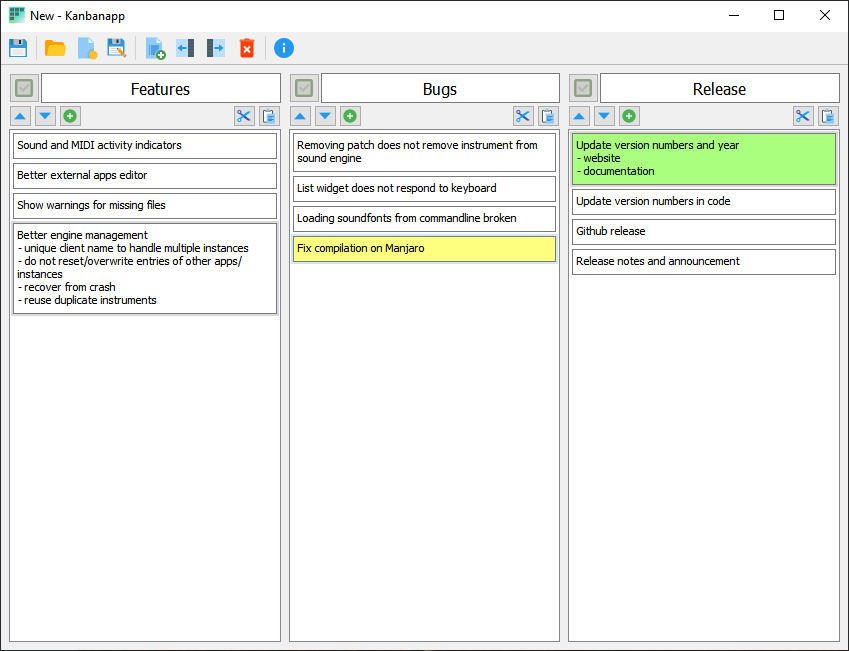

Kanbanapp
===========
A simple offline Kanban-like app
--------------------------------

2020 Gideon van der Kolf, noedigcode@gmail.com



Kanbanapp is a simple desktop application that allows you to organize notes
(cards) in lists similar to a Kanban board.

Much can be said about Kanbanapp. One may call it distributed. Cards are distributed
among lists. Also, it is an offline system as it saves files on your computer which
integrates well with distributed version control systems. Kanbanapp allows one to
keep track of and plan basically anything - be it writing software, starting a
company, machine learning, deep learning, AI, industry 4.0, IOT - it covers all
the bases and buzz words. In a way, one can say that it is the most important
app that you will use. Completely free, even for commercial use.

Simple. Offline. Free.

Kanbanapp.

Requirements:
-------------
* Qt 5
* Windows or Linux (and probably Mac too)
* A positive attitude and a determination to follow your dreams

Building:
---------

Open the kanbanapp.pro file with QtCreator and build, or run the following from the command line:
```
qmake kanbanapp.pro
make
```
-----

If you like this and find it useful,

<a href="https://www.buymeacoffee.com/noedigcode" target="_blank"></a>
