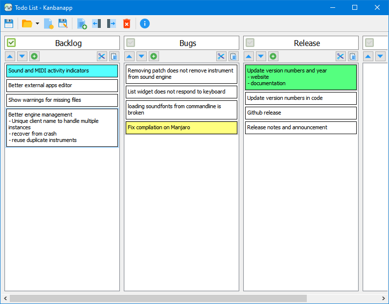

Kanbanapp
===========
A simple offline Kanban-like app
--------------------------------

2020-2024 Gideon van der Kolf, noedigcode@gmail.com



Kanbanapp is a simple desktop application that allows you to organize notes
(cards) in lists similar to a Kanban board.

Much can be said about Kanbanapp. One may call it distributed. Cards are distributed
among lists. Also, it is an offline system as it saves files on your computer in
JSON format which integrates well with distributed version control systems. If you
are so inclined, the cards and lists can also be called blocks and chains, referred
to as blockchains for short. Furthermore, Kanbanapp allows one to keep track of
and plan basically anything - be it writing software, starting a company, machine
learning, deep learning, AI, industry 4.0, IOT - it covers all the bases and buzz
words. In a way, one can say that it is the most important app that you will use.
Completely free, even for commercial use. (Having said that, if you want to pay
for a commercial license, don't hesitate to contact me.)

Simple. Offline. Free.

Kanbanapp.

Requirements:
-------------
* Qt 5
* Windows or Linux (and probably Mac too)
* A positive attitude and a determination to follow your dreams

Building:
---------

Open the kanbanapp.pro file with QtCreator and build, or run the following from the command line:
```
qmake kanbanapp.pro
make
```

